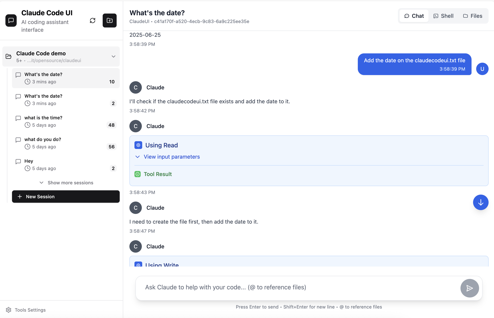
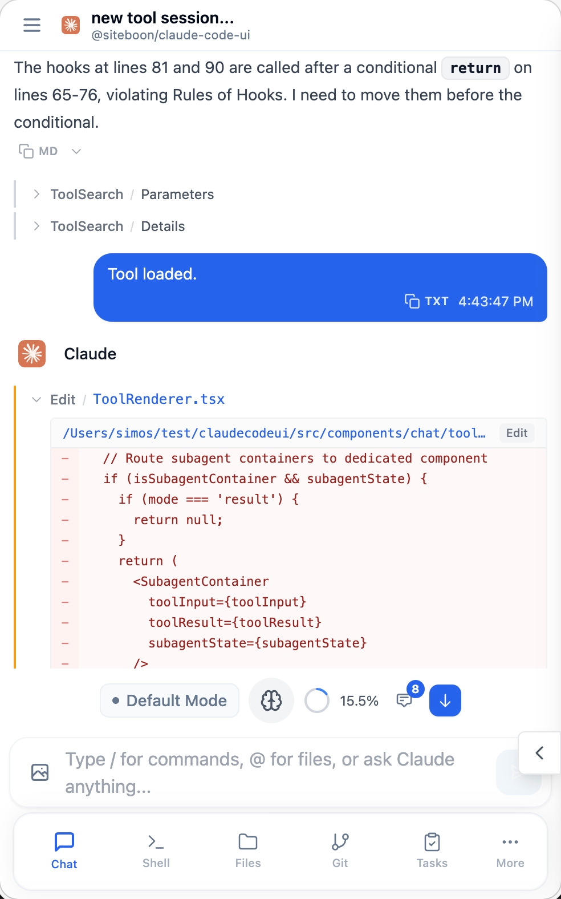
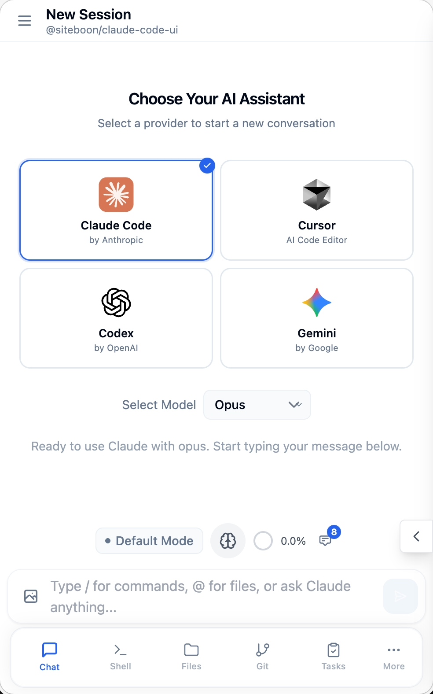
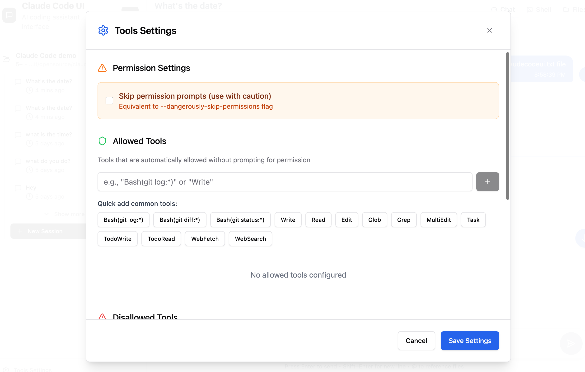

<div align="center">
 
 <h1>Cloud CLI (aka AURONEXIS)</h1>
 <p>A desktop and mobile UI for <a href="https://docs.anthropic.com/en/docs/claude-code">Claude Code</a>, <a href="https://docs.cursor.com/en/cli/overview">Cursor CLI</a>, and <a href="https://developers.openai.com/codex">Codex</a>.<br>Use it locally or remotely to view your active projects and sessions from everywhere.</p>
</div>

<p align="center">
 <a href="https://AURONEXIS.ai">AURONEXIS Cloud</a> · <a href="https://AURONEXIS.ai/docs">Documentation</a> · <a href="https://discord.gg/buxwujPNRE">Discord</a> · <a href="https://github.com/AURONEXIS-team/claudecodeui/issues">Bug Reports</a> · <a href="CONTRIBUTING.md">Contributing</a>
</p>

<p align="center">
 <a href="https://AURONEXIS.ai"></a>
 <a href="https://discord.gg/buxwujPNRE"></a>
 <br><br>
 <a href="https://trendshift.io/repositories/15586" target="_blank"></a>
</p>

<div align="right"><i><b>English</b> · <a href="./docs/README.ru.md">Русский</a> · <a href="./docs/README.de.md">Deutsch</a> · <a href="./docs/README.ko.md">한국어</a> · <a href="./docs/README.zh-CN.md">简体中文</a> · <a href="./docs/README.zh-TW.md">繁體中文</a> · <a href="./docs/README.ja.md">日本語</a> · <a href="./docs/README.tr.md">Türkçe</a></i></div>

---

## Screenshots

<div align="center">

<table>
<tr>
<td align="center">
<h3>Desktop View</h3>

<br>
<em>Main interface showing project overview and chat</em>
</td>
<td align="center">
<h3>Mobile Experience</h3>

<br>
<em>Responsive mobile design with touch navigation</em>
</td>
</tr>
<tr>
<td align="center" colspan="2">
<h3>CLI Selection</h3>

<br>
<em>Select between Claude Code, Cursor CLI and Codex</em>
</td>
</tr>
</table>


</div>

## Features

- **Responsive Design** - Works seamlessly across desktop, tablet, and mobile so you can also use Agents from mobile 
- **Interactive Chat Interface** - Built-in chat interface for seamless communication with the Agents
- **Integrated Shell Terminal** - Direct access to the Agents CLI through built-in shell functionality
- **File Explorer** - Interactive file tree with syntax highlighting and live editing
- **Git Explorer** - View, stage and commit your changes. You can also switch branches 
- **Browser Use** - Open browser sessions for web research, testing, and agent-driven browser tasks
- **Session Management** - Resume conversations, manage multiple sessions, and track history
- **Plugin System** - Extend AURONEXIS with custom plugins — add new tabs, backend services, and integrations. [Build your own →](https://github.com/AURONEXIS-ai/AURONEXIS-plugin-starter)
- **TaskMaster AI Integration** *(Optional)* - Advanced project management with AI-powered task planning, PRD parsing, and workflow automation
- **Model Compatibility** - Works with Claude and GPT model families (the full list of supported models is available at runtime via `GET /api/providers/:provider/models`)


## Quick Start

### AURONEXIS Cloud (Recommended)

The fastest way to get started — no local setup required. Get a fully managed, containerized development environment accessible from the web, mobile app, API, or your favorite IDE.

**[Get started with AURONEXIS Cloud](https://AURONEXIS.ai)**

### Self-Hosted (Open source)

#### npm

Try AURONEXIS Agent Suite instantly with **npx** (requires **Node.js** v22+):

```
npx @AURONEXIS-ai/AURONEXIS
```

Or install **globally** for regular use:

```
npm install -g @AURONEXIS-ai/AURONEXIS
AURONEXIS
```

Open `http://localhost:3001` — all your existing sessions are discovered automatically.

Visit the **[documentation →](https://AURONEXIS.ai/docs)** for full configuration options, PM2, remote server setup and more.

#### Docker Sandboxes (Experimental)

Run agents in isolated sandboxes with hypervisor-level isolation. Starts Claude Code by default. Requires the [`sbx` CLI](https://docs.docker.com/ai/sandboxes/get-started/).

```
npx @AURONEXIS-ai/AURONEXIS@latest sandbox ~/my-project
```

Supports Claude Code and Codex. See the [sandbox docs](docker/) for setup and advanced options.

### Desktop Companion App

AURONEXIS Desktop is an optional native companion for AURONEXIS Cloud and Local AURONEXIS. It ships from this repository's GitHub Releases and keeps AURONEXIS available from your menu bar or tray.

- **[macOS](https://AURONEXIS.ai/download/macos)**
- **[Windows](https://AURONEXIS.ai/download/windows)**
- **[Download page](https://AURONEXIS.ai/download)** · **[GitHub Releases and checksums](https://github.com/AURONEXIS-team/claudecodeui/releases)**

Use it to open AURONEXIS Cloud environments, switch between local and remote workspaces, and copy mobile/browser URLs. To work locally, choose **Local AURONEXIS** in the desktop app; it will use your running local server or start one for you.


---

## Which option is right for you?

AURONEXIS Agent Suite is the open source UI layer that powers AURONEXIS Cloud. You can self-host it on your own machine, run it in a Docker sandbox for isolation, or use AURONEXIS Cloud for a fully managed environment.

| | Self-Hosted (npm) | Self-Hosted (Docker Sandbox) *(Experimental)* | AURONEXIS Cloud |
|---|---|---|---|
| **Best for** | Local agent sessions on your own machine | Isolated agents with web/mobile IDE | Teams who want agents in the cloud |
| **How you access it** | Browser via `[yourip]:port` | Browser via `localhost:port` | Browser, any IDE, REST API, n8n |
| **Setup** | `npx @AURONEXIS-ai/AURONEXIS` | `npx @AURONEXIS-ai/AURONEXIS@latest sandbox ~/project` | No setup required |
| **Isolation** | Runs on your host | Hypervisor-level sandbox (microVM) | Full cloud isolation |
| **Machine needs to stay on** | Yes | Yes | No |
| **Mobile access** | Any browser on your network | Any browser on your network | Any device |
| **Desktop companion** | Optional. Choose Local AURONEXIS | Optional. Choose Local AURONEXIS | Optional. Opens cloud environments |
| **Agents supported** | Claude Code, Cursor CLI, Codex | Claude Code, Codex | Claude Code, Cursor CLI, Codex |
| **File explorer and Git** | Yes | Yes | Yes |
| **MCP configuration** | Synced with `~/.claude` | Managed via UI | Managed via UI |
| **REST API** | Yes | Yes | Yes |
| **Team sharing** | No | No | Yes |
| **Platform cost** | Free, open source | Free, open source | Starts at €7/month |

> All options use your own AI subscriptions (Claude, Cursor, etc.) — AURONEXIS provides the environment, not the AI.

---

## Security & Tools Configuration

**🔒 Important Notice**: All Claude Code tools are **disabled by default**. This prevents potentially harmful operations from running automatically.

### Enabling Tools

To use Claude Code's full functionality, you'll need to manually enable tools:

1. **Open Tools Settings** - Click the gear icon in the sidebar
2. **Enable Selectively** - Turn on only the tools you need
3. **Apply Settings** - Your preferences are saved locally

<div align="center">


*Tools Settings interface - enable only what you need*

</div>

**Recommended approach**: Start with basic tools enabled and add more as needed. You can always adjust these settings later.

---

## Plugins

AURONEXIS has a plugin system that lets you add custom tabs with their own frontend UI and optional Node.js backend. Install plugins from git repos directly in **Settings > Plugins**, or build your own.

### Available Plugins

| Plugin | Description |
|---|---|
| **[Project Stats](https://github.com/AURONEXIS-ai/AURONEXIS-plugin-starter)** | Shows file counts, lines of code, file-type breakdown, largest files, and recently modified files for your current project |
| **[Web Terminal](https://github.com/AURONEXIS-ai/AURONEXIS-plugin-terminal)** | Full xterm.js terminal with multi-tab support |
| **[Claude Watch](https://github.com/satsuki19980613/AURONEXIS-claude-watch)** | Watches long-running Claude Code sessions for hangs and exposes process controls |
| **[AURONEXIS Scheduler](https://github.com/grostim/AURONEXIS-cron)** | Create workspace-scoped scheduled prompts and execute them through a local CLI such as Codex or Claude Code |
| **[PRISM AURONEXIS](https://github.com/jakeefr/AURONEXIS-plugin-prism)** | Session intelligence for Claude Code inside AURONEXIS, including token burn visibility |
| **[Sessions](https://github.com/strykereye2/AURONEXIS-plugin-session-manager)** | View, manage, and kill active Claude Code sessions |
| **[Token Cost Calculator](https://github.com/NightmareAway/AURONEXIS-plugin-token-cost-calculator)** | Calculate API costs from model prices and token usage, with preset model pricing support |
| **[Task Queue](https://github.com/TadMSTR/AURONEXIS-plugin-task-queue)** | Task queue dashboard to view, filter, and launch agent tasks |
| **[GitHub Issues Board](https://github.com/szmidtpiotr/claude-github-issue)** | Kanban board for GitHub Issues with bidirectional TaskMaster sync and /github-task CLI skill auto-install |

### Build Your Own

**[Plugin Starter Template →](https://github.com/AURONEXIS-ai/AURONEXIS-plugin-starter)** — fork this repo to create your own plugin. It includes a working example with frontend rendering, live context updates, and RPC communication to a backend server.

**[Plugin Documentation →](https://AURONEXIS.ai/docs/plugin-overview)** — full guide to the plugin API, manifest format, security model, and more.

---
## FAQ

<details>
<summary>How is this different from Claude Code Remote Control?</summary>

Claude Code Remote Control lets you send messages to a session already running in your local terminal. Your machine has to stay on, your terminal has to stay open, and sessions time out after roughly 10 minutes without a network connection.

AURONEXIS Agent Suite and AURONEXIS Cloud extend Claude Code rather than sit alongside it — your MCP servers, permissions, settings, and sessions are the exact same ones Claude Code uses natively. Nothing is duplicated or managed separately.

Here's what that means in practice:

- **All your sessions, not just one** — AURONEXIS Agent Suite auto-discovers every session from your `~/.claude` folder. Remote Control only exposes the single active session to make it available in the Claude mobile app.
- **Your settings are your settings** — MCP servers, tool permissions, and project config you change in AURONEXIS Agent Suite are written directly to your Claude Code config and take effect immediately, and vice versa.
- **Works with more agents** — Claude Code, Cursor CLI and Codex, not just Claude Code.
- **Full UI, not just a chat window** — file explorer, Git integration, MCP management, and a shell terminal are all built in.
- **AURONEXIS Cloud runs in the cloud** — close your laptop, the agent keeps running. No terminal to babysit, no machine to keep awake.

</details>

<details>
<summary>Do I need to pay for an AI subscription separately?</summary>

Yes. AURONEXIS provides the environment, not the AI. You bring your own Claude, Cursor, or Codex subscription. AURONEXIS Cloud starts at €7/month for the hosted environment on top of that.

</details>

<details>
<summary>Can I use AURONEXIS Agent Suite on my phone?</summary>

Yes. For self-hosted, run the server on your machine and open `[yourip]:port` in any browser on your network. For AURONEXIS Cloud, open it from any device — no VPN, no port forwarding, no setup. A native app is also in the works.

</details>

<details>
<summary>Will changes I make in the UI affect my local Claude Code setup?</summary>

Yes, for self-hosted. AURONEXIS Agent Suite reads from and writes to the same `~/.claude` config that Claude Code uses natively. MCP servers you add via the UI show up in Claude Code immediately and vice versa.

</details>

---

## Community & Support

- **[Documentation](https://AURONEXIS.ai/docs)** — installation, configuration, features, and troubleshooting
- **[Discord](https://discord.gg/buxwujPNRE)** — get help and connect with other users
- **[GitHub Issues](https://github.com/AURONEXIS-team/claudecodeui/issues)** — bug reports and feature requests
- **[Contributing Guide](CONTRIBUTING.md)** — how to contribute to the project

## License

GNU Affero General Public License v3.0 or later (AGPL-3.0-or-later) — see [LICENSE](LICENSE) for the full text, including additional terms under Section 7.

This project is open source and free to use, modify, and distribute under the AGPL-3.0-or-later license. If you modify this software and run it as a network service, you must make your modified source code available to users of that service.

AURONEXIS Agent Suite - (https://AURONEXIS.ai).

## Acknowledgments

### Built With
- **[Claude Code](https://docs.anthropic.com/en/docs/claude-code)** - Anthropic's official CLI
- **[Cursor CLI](https://docs.cursor.com/en/cli/overview)** - Cursor's official CLI
- **[Codex](https://developers.openai.com/codex)** - OpenAI Codex
- **[React](https://react.dev/)** - User interface library
- **[Vite](https://vitejs.dev/)** - Fast build tool and dev server
- **[Tailwind CSS](https://tailwindcss.com/)** - Utility-first CSS framework
- **[CodeMirror](https://codemirror.net/)** - Advanced code editor
- **[TaskMaster AI](https://github.com/eyaltoledano/claude-task-master)** *(Optional)* - AI-powered project management and task planning


### Sponsors
- [AURONEXIS-team - AI powered website builder](https://AURONEXIS-team.ai)
---

<div align="center">
 <strong>Made with care for the Claude Code, Cursor and Codex community.</strong>
</div>
